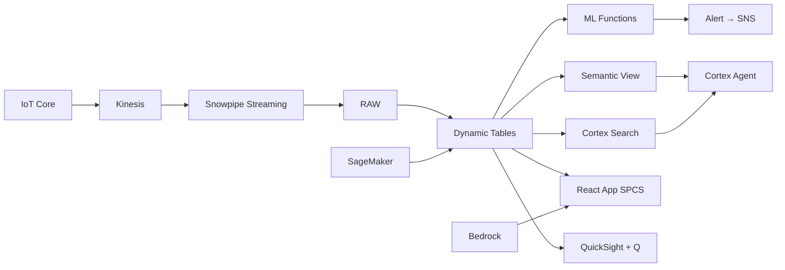

# Semiconductor Yield Optimization & Defect Detection

Real-time yield monitoring across 12 Malaysian fabs — Snowflake ML detects degradation, classifies defect patterns, forecasts equipment failures, and alerts process engineers before excursions cascade.

## Architecture

Malaysia's Penang-Kulim corridor is home to 12 semiconductor fabs producing chips for Intel, Infineon, Micron, and AMD. A 3.2% yield degradation across 4 fabs is costing RM 200M annually — but the root cause spans equipment drift, particle contamination, and process parameter changes that traditional monitoring tools detect too late.



## Snowflake Capabilities

| Capability | Implementation |
|-----------|---------------|
| Dynamic Tables | FAB_YIELD_SUMMARY / YIELD_TIMESERIES / EQUIPMENT_HEALTH / DEFECT_PARETO |
| ML Functions | ML.FORECAST + ML.ANOMALY_DETECTION |
| Cortex AI | COMPLETE_MULTIMODAL, AI_CLASSIFY, SUMMARIZE |
| Cortex Search | 80 documents indexed |
| Cortex Agent | YIELD_INTELLIGENCE_AGENT |
| Semantic View | SEMICONDUCTOR_ANALYTICS |
| React App (SPCS) | 5 tabs + DemoGuide |


## AWS Services

| Service | Role in Demo |
|---------|-------------|
| AWS IoT Core | Ingest equipment sensor telemetry (500K readings) |
| Amazon Kinesis | Stream sensor data to Snowpipe Streaming |
| Amazon SageMaker | Wafer defect image classification (vision model) |
| Amazon Bedrock (Claude) | Generate root-cause narratives and corrective action memos |
| Amazon SNS | Alert target for yield degradation notifications |
| Amazon QuickSight + Q | Executive manufacturing dashboard with natural language |


## Personas

| Persona | Role | Key Questions |
|---------|------|---------------|
| **Dr. Tan Wei Lin** | VP Manufacturing | "Which fabs are below yield target?" "What's our total yield loss in ringgit?" |
| **Ahmad bin Ismail** | Process Engineer | "What's causing the yield drop in FAB-002?" "Show me the defect Pareto for particle contamination." |


## Data

| Table | Rows | Description |
|-------|------|-------------|
| FABS | 12 | Fabrication facilities (Penang + Kulim) |
| PRODUCTS | 8 | Wafer product types (Logic, Power, MEMS, RF, etc.) |
| EQUIPMENT | 120 | Critical manufacturing tools across all fabs |
| WAFER_LOTS | 5,000 | 90 days of lot production records with yield |
| EQUIPMENT_TELEMETRY | 500,000 | Sensor readings (pressure, temp, RF power, flow) |
| PROCESS_DOCUMENTS | 80 | SOPs, ECNs, quality alerts, investigation reports |
| WEATHER_PENANG | 365 | Ambient conditions (humidity/temp impact on yield) |
| ASEAN_MACRO | 8 | Malaysia semiconductor export context |


## Build Instructions

### Prerequisites
- Snowflake account with ACCOUNTADMIN access
- Cortex AI enabled (ML Functions, Search, Agent)
- Warehouse: SEMI_WH (Medium)
- AWS CLI with access (us-west-2)

### Deployment

```bash
snowsql -f snowflake/00_setup.sql
snowsql -f snowflake/01_marketplace_install.sql
snowsql -f snowflake/02_raw_tables.sql
snowsql -f snowflake/03_staging.sql
snowsql -f snowflake/04_dynamic_tables.sql
snowsql -f snowflake/05_search.sql
snowsql -f snowflake/06_ml_models.sql
snowsql -f snowflake/07_semantic_view.sql
snowsql -f snowflake/08_agent.sql
```

### React App (SPCS)
```bash
cd app && npm ci && npm run build
docker build -t aws-malaysia-semiconductor-yield-app .
docker push bdiqc8sm-default.registry.snowflakecomputing.com/semiconductor_yield/app/aws_malaysia_semiconductor_yield/app:latest
```

### Demo Mode
Open the app URL with `?demo=true` for presenter view.

## Build Modes

### Snowflake Only
Run scripts 00-08 (skip AWS-specific integration). Uses:
- **Snowpipe Streaming SDK** instead of AWS IoT Core
- **Snowpipe Streaming SDK (direct)** instead of Amazon Kinesis
- **Cortex Complete (multimodal)** instead of Amazon SageMaker
- **Cortex Complete** instead of Amazon Bedrock (Claude)
- **Alerts + Notification Integration** instead of Amazon SNS
- **Snowflake Intelligence (Cortex Analyst)** instead of Amazon QuickSight + Q

### Full AWS + Snowflake
Run all scripts including AWS integration. Deploy QuickSight dashboard from `quicksight/`.

## Business Impact

Industry research and Snowflake customer outcomes:
- **Malaysia semiconductor exports reached RM 450B (US$98B) in 2023, representing 18.4% of GDP** — [MIDA](https://www.mida.gov.my/setting-up-in-malaysia/why-malaysia/)
- **AI-powered yield optimization improves fab yield 2-5% — worth $50-100M annually per fab** — [McKinsey Semiconductors](https://www.mckinsey.com/industries/semiconductors/our-insights)
- **Predictive maintenance in semiconductor fabs reduces unplanned downtime by 30-50%** — [Deloitte Smart Factory](https://www2.deloitte.com/us/en/insights/focus/industry-4-0/smart-factory-connected-manufacturing.html)
- **Yamaha Motor achieved real-time manufacturing intelligence on Snowflake** — [Snowflake Customers](https://www.snowflake.com/en/customers/all-customers/yamaha-motor/)


## Key Demo Numbers

- **RM 200M** annual yield loss across 12 fabs (US$47M)
- **4 of 12 fabs** below target yield (CRITICAL status)
- **17 equipment alarms** in the last 48 hours
- **7 of 14 days** anomalous for FAB-002 (ML.ANOMALY_DETECTION)
- **2,847 defects** classified by Cortex AI
- **12 process documents** flagged CRITICAL by AI classification
- **3 tools** predicted to fail within 72 hours (ML.FORECAST)


## License

Apache 2.0 — See [LICENSE](LICENSE) for details.

This is a personal demo project and is not an official Snowflake offering. It comes with no support or warranty.