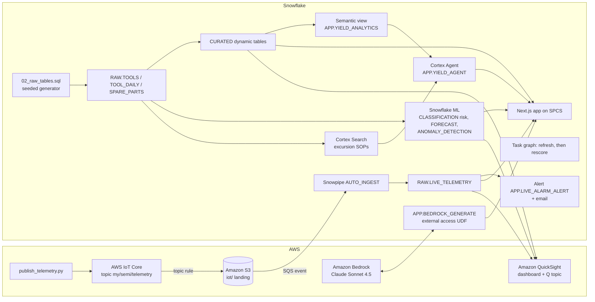

# APJ Semiconductor Yield - Malaysia Wafer Fabs

End-to-end yield monitoring for **24 process tools across 5 Malaysian fab sites** (Penang, Kulim, Melaka, Ipoh, Kuching) using Snowflake, optionally with AWS: from a live tool alarm to a 7-day excursion-risk score, an alarm email and an AI action memo.

## Architecture

A wafer-fab yield pipeline built on **Snowflake** (Dynamic Tables, Snowflake ML, Cortex Search, Cortex Agent, Cortex AI_COMPLETE, SPCS) and, in the full build, **AWS** (IoT Core, S3, Bedrock Claude, QuickSight + Amazon Q). Tool telemetry lands in `RAW.LIVE_TELEMETRY`. Dynamic tables curate 90 days of tool-day history: die yield, defects per wafer, excursions and availability. Snowflake ML scores 7-day excursion risk per tool, forecasts fab-wide die yield and flags RF power drift anomalies. A Cortex Agent answers questions with SOP citations, and an LLM drafts the yield action memo.

Interactive diagrams (hover for object names): [Snowflake only](docs/architecture-snowflake.html) | [AWS + Snowflake](docs/architecture-aws.html). The app shows both on its Architecture & Data tab, the current build first. Regenerate them with `python3 docs/build_architecture.py`.


```mermaid
flowchart LR
    subgraph AWS
      SIM[publish_telemetry.py] --> IOT[AWS IoT Core<br/>topic my/semi/telemetry]
      IOT -->|topic rule| S3[(Amazon S3<br/>iot/ landing)]
      BR[Amazon Bedrock<br/>Claude Sonnet 4.5]
      QS[Amazon QuickSight<br/>dashboard + Q topic]
    end
    subgraph Snowflake
      S3 -->|SQS event| PIPE[Snowpipe AUTO_INGEST] --> LIVE[RAW.LIVE_TELEMETRY]
      GEN[02_raw_tables.sql<br/>seeded generator] --> RAW[RAW.TOOLS / TOOL_DAILY / SPARE_PARTS]
      RAW --> DT[CURATED dynamic tables]
      RAW --> ML[Snowflake ML<br/>CLASSIFICATION risk, FORECAST,<br/>ANOMALY_DETECTION]
      DT --> SV[Semantic view<br/>APP.YIELD_ANALYTICS]
      RAW --> CS[Cortex Search<br/>excursion SOPs]
      SV --> AG[Cortex Agent<br/>APP.YIELD_AGENT]
      CS --> AG
      LIVE --> AL[Alert APP.LIVE_ALARM_ALERT<br/>+ email]
      UDF[APP.BEDROCK_GENERATE<br/>external access UDF]
      TK[Task graph: refresh, then rescore]
      APP[Next.js app on SPCS]
    end
    BR <--> UDF
    DT --> APP
    ML --> APP
    LIVE --> APP
    AG --> APP
    UDF --> APP
    DT --> QS
    ML --> QS
    LIVE --> QS
```

The Snowflake-only build drops the AWS subgraph: `APP.SIMULATE_TELEMETRY` writes to `RAW.LIVE_TELEMETRY`, and the app calls Cortex `AI_COMPLETE` instead of the Bedrock UDF.

## Snowflake Capabilities

| Capability | Implementation |
|-----------|---------------|
| Dynamic Tables | `CURATED.KPI_SUMMARY`, `PERFORMANCE_SUMMARY`, `EXCURSION_CAUSES`, `TREND_ANALYSIS` from the RAW tables |
| Snowflake ML | CLASSIFICATION 7-day excursion risk (`ML.EXCURSION_RISK_SCORES`), 14-day die-yield FORECAST, RF power drift ANOMALY_DETECTION |
| Cortex Search | 17 synthetic excursion-response SOPs (one per process step and cause) in `SEARCH.PROCESS_SOP_SEARCH` |
| Semantic View | `APP.YIELD_ANALYTICS` over tools, excursion causes, daily yield and risk |
| Cortex Agent | `APP.YIELD_AGENT`: Cortex Analyst over the semantic view plus Cortex Search for SOP citations |
| Cortex AI | `AI_COMPLETE('claude-sonnet-4-5')` for grounded answers, and for the action memo in the Snowflake-only build |
| Alerts + Tasks | `APP.LIVE_ALARM_ALERT` logs ALARM readings and sends email; task graph `TASK_REFRESH_CURATED`, then `TASK_RESCORE_RISK` |
| Snowpark Container Services | Next.js app `APP.MY_SEMI_YIELD_APP` with 6 tabs: Executive Cockpit, Predictive, Tool Health, Live IoT, Ask AI, Architecture & Data |
| Snowpipe | `RAW.LIVE_TELEMETRY_PIPE` AUTO_INGEST from S3 (AWS build only) |

## AWS Services

Used only in the AWS + Snowflake build.

| Service | Role in Demo |
|---------|-------------|
| AWS IoT Core | Receives simulated tool telemetry (RF power drift, chamber temperature). A topic rule writes each message to S3 |
| Amazon S3 | Landing bucket. An event notification goes to the Snowpipe SQS queue |
| Amazon Bedrock | Claude Sonnet 4.5 writes the action memo, called from Snowflake through an external-access UDF |
| Amazon QuickSight | DIRECT_QUERY executive dashboard over Snowflake (daily die yield, excursions by tool, excursion risk) |
| Amazon Q | Natural-language questions over the QuickSight topic `my-semi-yield-topic` |
| AWS IAM | Least-privilege roles for S3, IoT and Bedrock |

## Personas

These personas are fictional.

| Persona | Role | Key Questions |
|---------|------|---------------|
| **Dr. Tan Wei Lin** | VP Manufacturing | "Which fab site has the lowest die yield?" "Which causes cost us the most die?" |
| **Ahmad bin Ismail** | Process Engineer | "Which tools are high excursion risk this week, and which SOP applies?" |

## Data

All data is synthetic and seeded, so every rebuild reproduces it. Tool names are fictional; the five sites are real Malaysian semiconductor hubs.

| Table | Rows | Description |
|-------|------|-------------|
| RAW.TOOLS | 24 | Process tools across 5 sites and 5 steps (Lithography, Etch, Deposition, CMP, Ion Implant) |
| RAW.TOOL_DAILY | 2,160 | Daily tool observations over 90 days: wafer moves, gross and good die, defects, excursions, root cause, PM, RF drift and chamber temperature |
| RAW.SPARE_PARTS | 24 | Required and on-hand chamber kits and consumables per tool |
| SEARCH.PROCESS_DOCS | 17 | Synthetic excursion-response SOPs indexed for Cortex Search |
| RAW.LIVE_TELEMETRY | Grows during the demo | Live readings from IoT Core (AWS build) or `APP.SIMULATE_TELEMETRY` (Snowflake-only build) |
| ML.EXCURSION_RISK_SCORES | 24 | 7-day excursion probability and risk band per tool |

## Build Instructions

### Prerequisites
- Snowflake account with ACCOUNTADMIN access, and Cortex AI enabled (AI_COMPLETE, Search, Agent).
- An X-Small warehouse with auto-suspend at or below 120 s, and an existing SPCS compute pool.
- Python 3.11+, `snowflake-connector-python`, Node.js 22+, Docker and the `snow` CLI.
- App image: run `snow spcs image-registry login`, then build and push `my-semi-yield-app:v1` to the database's `APP.IMAGES` repository (see the header of `snowflake/07_deploy_app.sql`).
- AWS build only: `boto3`, AWS credentials for the target account (us-west-2) with Bedrock access, and QuickSight Enterprise.

### SPCS App
```
<DATABASE>.APP.MY_SEMI_YIELD_APP
```

### Tests
```bash
python -m pytest aws snowflake quicksight
```

For a local run, put `SNOWFLAKE_ACCOUNT`, `SNOWFLAKE_USER`, `SNOWFLAKE_DATABASE`, `SNOWFLAKE_WAREHOUSE`, `SNOWFLAKE_AUTHENTICATOR=PROGRAMMATIC_ACCESS_TOKEN`, `SNOWFLAKE_TOKEN` and `DEMO_PLATFORM` in the environment, then run `npm --prefix app run build && npm --prefix app start`.

## Build Modes

Both modes share the same core. They differ in three places, and the app's `DEMO_PLATFORM` setting (in its SPCS spec) switches the memo provider and the Live IoT tab.

| Layer | Snowflake Only | Full AWS + Snowflake |
|---|---|---|
| Live telemetry | `CALL APP.SIMULATE_TELEMETRY(n)` inserts simulated readings into `RAW.LIVE_TELEMETRY`. This simulates a sensor feed; it is not Snowpipe Streaming | `aws/publish_telemetry.py` to AWS IoT Core, then S3, SQS and Snowpipe AUTO_INGEST |
| Action memo | Cortex `AI_COMPLETE('claude-sonnet-4-5')` | Amazon Bedrock Claude Sonnet 4.5 through `APP.BEDROCK_GENERATE` |
| BI and natural-language questions | The SPCS app is the dashboard; questions go to the Cortex Agent | Also a QuickSight dashboard and an Amazon Q topic |
| App setting | `DEMO_PLATFORM: snowflake` | `DEMO_PLATFORM: aws` |

### Snowflake Only

```bash
# 1. Core data and dynamic tables (guarded: new isolated database only)
python snowflake/run_core.py --database MALAYSIA_SEMI_YIELD_SNOWFLAKE --warehouse <XS_WAREHOUSE> --connection <CONNECTION> --apply
# 2. Native telemetry, ML, search, semantic view, agent, alert and task graph
python snowflake/run_intelligence.py --database MALAYSIA_SEMI_YIELD_SNOWFLAKE --platform snowflake --warehouse <XS_WAREHOUSE> --connection <CONNECTION> --alert-email you@example.com
# 3. App on SPCS with DEMO_PLATFORM=snowflake (push the image first)
python snowflake/run_intelligence.py --database MALAYSIA_SEMI_YIELD_SNOWFLAKE --platform snowflake --warehouse <XS_WAREHOUSE> --connection <CONNECTION> --alert-email you@example.com --files 07_deploy_app.sql --compute-pool <COMPUTE_POOL>
```

During the demo:
- Run `CALL APP.SIMULATE_TELEMETRY(20)` to add live readings. For a continuous feed, run `ALTER TASK APP.TASK_SIMULATE_TELEMETRY RESUME`, and `SUSPEND` it afterwards.
- Run `EXECUTE ALERT APP.LIVE_ALARM_ALERT` to raise the alarm email.
- Run `EXECUTE TASK APP.TASK_REFRESH_CURATED` to refresh the curated tables and rescore risk.

Afterwards, drop the database or run `ALTER SERVICE APP.MY_SEMI_YIELD_APP SUSPEND`.

### Full AWS + Snowflake

```bash
# 1. Core data and dynamic tables (guarded: new isolated database only)
python snowflake/run_core.py --database MALAYSIA_SEMI_YIELD_AWS --warehouse <XS_WAREHOUSE> --connection <CONNECTION> --apply
# 2. AWS ingestion and Bedrock (dry run first, then --apply)
python aws/setup_aws.py --database MALAYSIA_SEMI_YIELD_AWS --account <AWS_ACCOUNT_ID> --connection <CONNECTION> --apply
# 3. ML, search, semantic view, agent, alert and task graph
python snowflake/run_intelligence.py --database MALAYSIA_SEMI_YIELD_AWS --platform aws --warehouse <XS_WAREHOUSE> --connection <CONNECTION> --alert-email you@example.com
# 4. App on SPCS with DEMO_PLATFORM=aws (push the image first)
python snowflake/run_intelligence.py --database MALAYSIA_SEMI_YIELD_AWS --platform aws --warehouse <XS_WAREHOUSE> --connection <CONNECTION> --alert-email you@example.com --files 07_deploy_app.sql --compute-pool <COMPUTE_POOL>
# 5. QuickSight dashboard and Q topic (needs an existing Snowflake data source)
python quicksight/build_dashboards.py --database MALAYSIA_SEMI_YIELD_AWS --account <AWS_ACCOUNT_ID> --principal-arn <QUICKSIGHT_USER_ARN> --data-source-arn <DATA_SOURCE_ARN> --prefix my-semi-yield --apply --update --with-topic
```

QuickSight objects must be shared with the QuickSight user who signs in (`--principal-arn`); otherwise the console shows nothing.

During the demo:
- Run `python aws/publish_telemetry.py --count 20` to send live readings.
- Run `EXECUTE ALERT APP.LIVE_ALARM_ALERT` to raise the alarm email.
- Run `EXECUTE TASK APP.TASK_REFRESH_CURATED` to refresh the curated tables and rescore risk.

Afterwards, `python aws/teardown_aws.py --database MALAYSIA_SEMI_YIELD_AWS --account <AWS_ACCOUNT_ID> --connection <CONNECTION> --apply` removes the AWS resources and the account-level Bedrock external-access and S3 storage integrations. It leaves the email integration `MY_SEMI_YIELD_EMAIL_INT`, which the Snowflake-only build also uses.

## Business Impact

Industry research and Snowflake customer outcomes:
- **Malaysia** contributes 13% of global semiconductor Assembly, Testing and Packaging (ATP) volume and ranks as the 6th-largest semiconductor exporter globally; the Electrical and Electronics sector accounts for over 40% of the nation's exports -- [MIDA, Beyond Assembly Lines](https://www.mida.gov.my/beyond-assembly-lines-powering-malaysias-rise-in-semiconductor-and-high-tech-frontiers/)
- **Predictive maintenance**, on average, increases productivity by 25%, reduces breakdowns by 70% and lowers maintenance costs by 25% -- [Deloitte Analytics Institute, Predictive Maintenance position paper](https://www.deloitte.com/content/dam/assets-zone2/de/de/docs/about/2024/Deloitte_Predictive-Maintenance_PositionPaper.pdf)
- **Wolfspeed** (Snowflake customer, silicon carbide semiconductor manufacturing) unified more than 200 data silos with Snowflake Intelligence. Certain teams went from spending 30% of their time hunting for data, 50% cleaning and enriching it and 20% on analysis, to 20% on enrichment and 80% on analysis, decisions and actions -- [Snowflake blog: How Modern Manufacturers Are Transforming Operations with Snowflake Intelligence](https://www.snowflake.com/en/blog/transforming-manufacturing-snowflake-intelligence/)

## Key Demo Numbers

These figures are synthetic and come from the seeded demo data. Forecast and anomaly figures can shift slightly with the build day.

- **24 tools**, 2,160 tool-days over 90 days, across 5 fab sites and 5 process steps
- **Die yield 93.5%**; per-tool die yield ranges from 91.5% to 95.2%, and Melaka is the lowest site at 92.2%
- **152 yield excursions** across 10 root causes; scratches cost the most die
- **Excursion-risk model** out-of-time holdout: precision 0.59, recall 0.42 at a 0.5 threshold, against a 0.26 base rate. Six tools are high risk; the top tool is TL-0013, at 95.7%
- **14-day die-yield forecast** with prediction intervals; **12 of 384** tool-days flagged as RF power drift anomalies
- **17 SOPs** indexed for Cortex Search and cited by ID in agent answers

## License

Apache 2.0 — See [LICENSE](LICENSE) for details.

This is a personal demo project and is not an official Snowflake offering. It comes with no support or warranty. Industry metrics cited are from publicly available third-party research and Snowflake customer stories; they represent reported outcomes and are not guarantees of results.
